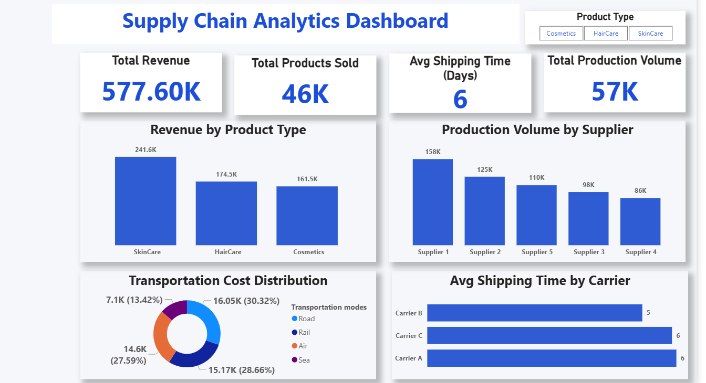
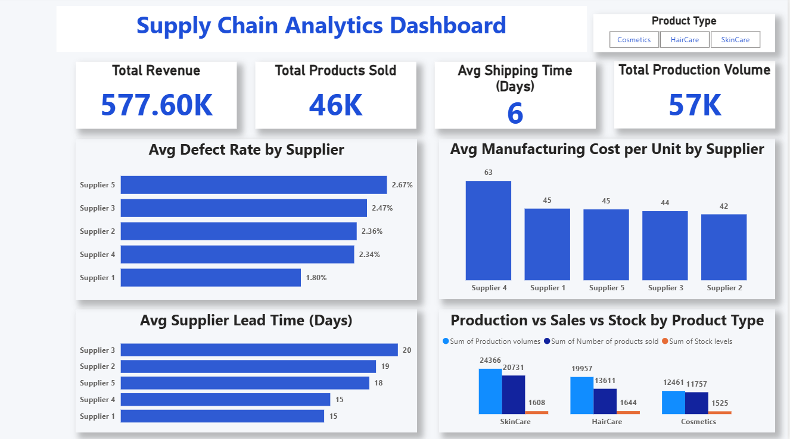
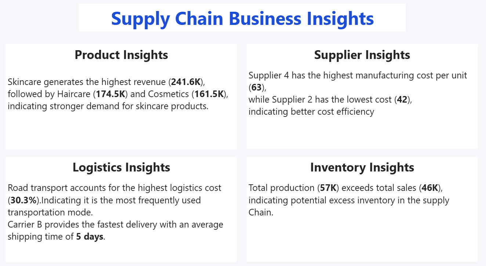

# 📊 Supply Chain Analytics Dashboard — Power BI
## 🔗 Project Overview
This project presents a Supply Chain Analytics Dashboard built using Power BI to analyze supply chain performance, supplier efficiency, logistics cost, and inventory balance.
The dashboard helps identify key operational insights and supports data-driven decision making in supply chain management.
## 🛠 Tools & Technologies
- Power BI
- Microsoft Excel
- Power Query
- DAX
- Data Cleaning & Transformation
## 📌 Business Questions Answered

- Which product category generates the highest revenue?
- Which suppliers contribute the most to production volume?
- Which supplier has the highest defect rate?
- Which supplier has the highest manufacturing cost per unit?
- Which supplier has the longest lead time?
- Which transportation mode contributes the most to logistics cost?
- Which shipping carrier delivers the fastest?
- Is production aligned with sales demand or is there excess inventory?
## 📊 Key KPIs

- Total Revenue
- Total Products Sold
- Average Shipping Time (Days)
- Total Production Volume
## 📊 Dashboard Features

- Interactive Power BI dashboard designed to analyze supply chain performance.
- Includes **three dashboard pages** for different levels of analysis:
  - **Overview Dashboard**
  - **Supplier & Operations Analysis**
  - **Business Insights**
- Interactive KPI cards for quick performance monitoring.
- Dynamic slicers for filtering and exploring data.
- Clean and professional dashboard layout for easy interpretation.
## 🔍 Key Insights

- Skincare products generate the highest revenue (**241.6K**), indicating strong customer demand in this category.

- Supplier 4 has the highest manufacturing cost per unit (**63**), while Supplier 2 operates at the lowest cost (**42**), showing better cost efficiency.

- Road transportation contributes the largest share of logistics cost (**30.3%**), making it the most frequently used transport mode.

- Carrier B provides the fastest delivery with an average shipping time of **5 days**.

- Total production (**57K**) exceeds total sales (**46K**), suggesting potential excess inventory in the supply chain.
## 🎯 Learning Outcomes

- Hands-on experience in building interactive **Power BI dashboards**
- Data cleaning and transformation using **Power Query**
- Creating KPI metrics and calculations using **DAX**
- Analyzing supply chain data to generate **business insights**
- Designing clear and professional dashboards for **data storytelling**
## 📂 Files Included

- **Supply_Chain_Dashboard.pbix** – Power BI dashboard file
- **supply_chain_dataset.csv** – Raw dataset used for analysis
- **overview_dashboard.png** – Screenshot of the Overview dashboard page
- **supplier_operations_dashboard.png** – Screenshot of the Supplier & Operations analysis page
- **business_insights_dashboard.png** – Screenshot of the Business Insights page
## 📷 Dashboard Preview

### Overview Dashboard

### Supplier & Operations Analysis

### Business Insights

